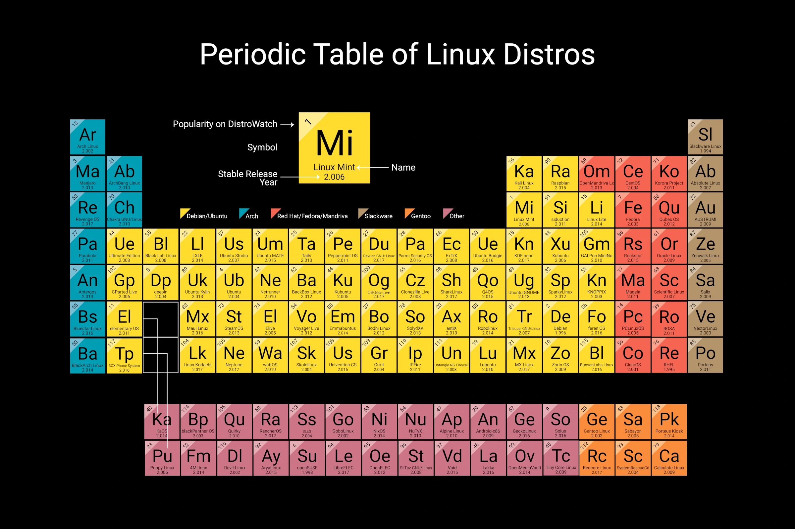
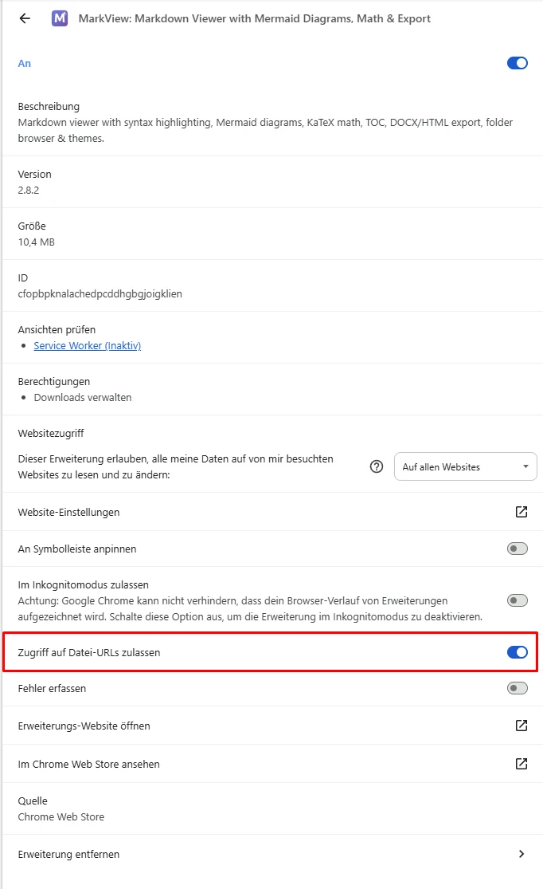

# Linux-Glossar

## Inhalt

- [Grundlagen](pages/basics/index.md)
- [Abkürzungen / Begriffe](pages/abbreviations.md)
- [Tastenkürzel](pages/shortcuts.md)
- [Befehle](pages/commands/index.md)
- [Wichtige Verzeichnisse](pages/directories.md)
- [Notizen](#notizen)

---

**Über 190 Befehle in 14 Kategorien.**

---

Bildquelle: [https://distrowatch.com/dwres.php?resource=family-tree](https://distrowatch.com/dwres.php?resource=family-tree)

## Notizen

**Hinweis:** Bei lokaler Nutzung (heruntergeladene bzw. geklonte `.md`-Dateien) empfiehlt sich zur besseren Darstellung die kostenlose Chrome-Erweiterung [MarkView – Markdown Viewer](https://chromewebstore.google.com/detail/markview-markdown-viewer/cfopbpknalachedpcddhgbgjoigklien)

Damit lokale `.md`-Dateien angezeigt werden, muss in den Einstellungen der Erweiterung die Option **Zugriff auf Datei-URLs zulassen** aktiviert werden (siehe Abbildung).

